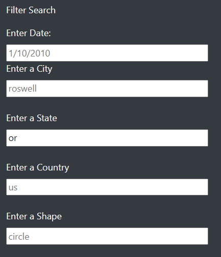
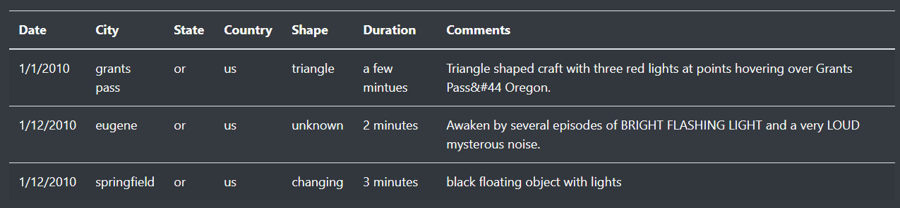

# UFOs

##    Project Overview

The aim of the project is to build a webpage that has a dynamic table which will provide in-depth analysis of UFO Sightings by allowing users to filter for multiple criteria at the same time.

The criteria that can be filtered for include the following:

* Date
* City
* State
* Country
* Shape

## Project Results

To perform a search there are five different criteria to choose from, below are steps to carry out the search:

#### Step 1

Input the criteria you are looking for. In the image below we are searching for the sightings in Oregon (or) and kept all other criteria constant.

#### Step 2

Press the Enter key after inputting the criteria and a list of results will show up as shown in the image below.

## Summary

The drawback of this webpage is the page not able to retain the results from a search once the page is refreshed. The refresh returns the page to and the table to the default settings.

### Recommendations

* Setup the Element for the State and Country as an Select elements instead of an Un-ordered List elements
* Search results should be retained even when the page is refreshed.